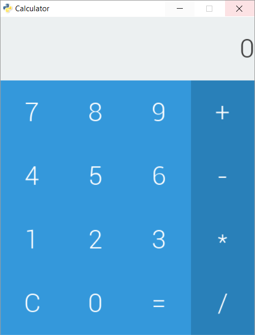

.. _basic-calculator-example:

Basic Calculator
=================

This examples illustrates a more in-depth use of the *Antlia* library to build a very basic calculator.

The GUI will display an area to show the numbers being added or multiplied, as well as a full numeric pad and some operators buttons.

Here is what will look like our basic calculator:

We start by creating the layout file. Let's call it ``calculator_layout.lia``.

These first two lines specify parameters relevant to the window.::

	.title Calculator
	.resolution 400 500

The window will thereby have *Calculator* as a title, and have a resolution of 400x500.

The most basic tool to structure a layout is the grid. Like any other element, we declare a grid by writting the ``grid`` keyword followed by its name, here ``main_grid``.

The following two lines are the grid parameters. Here, we only need two rows, the first will take 20% of the space, the other 80%.::

	grid man_grid
		.rows 0.2 0.8
		.cols 1.0

Let's add a label to show the result of the calculator's computations.::

	label result_label
		.label 0
		.align right

	
