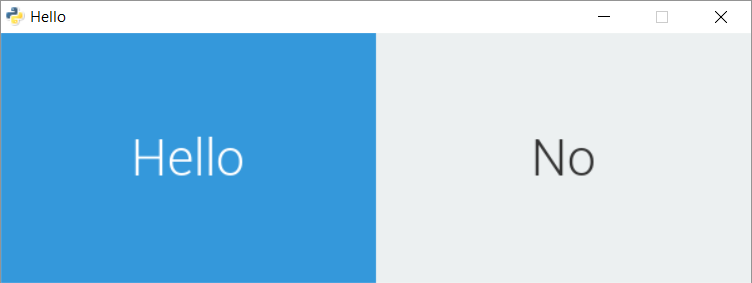

.. _hello-world-example:

Hello World!
=================

This very basic example demonstrates the simplicity of making GUI with Antlia.

The goal here is to show a button that, once clicked, will change the text displayed by a label next to it.

We only need two files:

* ``helloworld.py`` which will contain our Python code that will use *Antlia*,
* ``helloworld_layout.lia`` which will contain the layout of our simple example.

Let's start by importing *Antlia* into our Python script::

	from antlia import *

Now we can create a GUI object. A layout file needs to be specified. This layout file contains the structure of the GUI.

Even though this layout file has a ``.lia`` extension, only its name has to be passed to the constructor of the ``Antlia`` object.::

	GUI = Antlia("helloworld_layout")

Open the ``helloworld_layout.lia`` file, and write the following lines::

	.title Hello
	.resolution 600 200

	grid main_grid
		.rows 1.0
		.cols 0.5 0.5

		button hello_button
			.label Hello
		label hello_label
			.label No
			.align center

The structure of this file is quite easy to understand. The elements composing the GUI are declared by their names, and some attributes starting with ``.`` can then be specified.

The first attributes are linked to the window.

Back to the Python script, it is time to define the button's handler.::

	def buttonClickHandler():
		# Change the content of the label
		GUI.change("hello_label", "label", "Hello World!")

	# Bind the handler to the button
	GUI.bind("hello_button", "click", buttonClickHandler)

Whenever the ``hello_button`` attached to ``buttonClickHandler`` is clicked, the  latter is called.

The handler will change the value of the ``label`` property of the ``hello_label`` to *Hello World!*

Once every element of the GUI has been bound to their respective handlers, the GUI can be built and the window be shown.::

	GUI.start()

A forever loop will wait for the user to click on the exit button on top of the window to leave the program (the ``time`` module needs to be imported).::

	while not GUI.getUserInfo().want_to_stop:
		# Give some rest to the CPU
		time.sleep(0.1)

Finally, after the window is closed, we properly quit the GUI.::

	GUI.quit()

The full Python script used for this example is given below.::

	from antlia import *
	import time as ti

	# Create a GUI based on a layout file
	GUI = Antlia("ehelloworld_layout")

	# Define a handler for the button
	def buttonClickHandler():
		# Change the content of the label
		GUI.change("hello_label", "label", "Hello World!")

	# Bind the handler to the button
	GUI.bind("hello_button", "click", buttonClickHandler)

	# Open the GUI window
	GUI.start()

	# Main loop, wait for stop event
	while not GUI.getUserInfo().want_to_stop:
		# Give some rest to the CPU
		ti.sleep(0.1)

	# Destroy the GUI properly
	GUI.quit()

Here is the result:

