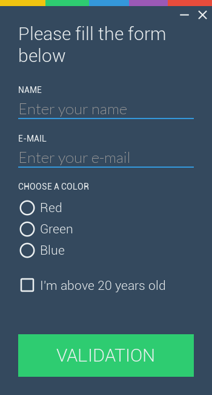

Forms are important components of a user interface. They make it easy to gather various pieces of information directly from the user.

This examples aims at showing how fast it is to set up a form using _Antlia_.

Here is the result:



## Python script

Let us start by the Python code to show how the form will actually work.

Start by the usual `import` statements, and by creating a new GUI object.

```python
from antlia import *
import time as ti

is_running = True

# Create a GUI based on a layout file and a style file
GUI = Antlia("form_layout", "form_style")
```

Here comes the part relevant to this demonstration. The `form` is basically a group of input elements. These elements' type can range from `text-input`, `check-box` to `radio`.
A form is fully functional when it contains a validation button. For more on this subject, please refer to [this documentation](../elements/form.md).

Once the validation button is clicked, a `validation` even is triggered, and all the information contained in the form can be accessed as a dictionary. Here, the `onFormValidationHandler(...)` function takes this very dictionary as argument, and allow the Python script to process the form's content after it has been validated.

```python
def onFormValidationHandler(form_values):
	is_form_filled = True
	for field in form_values:
		if form_values[field] == '':
			# Missing value
			is_form_filled = False
			GUI.change(field, "underline-color", "alizarin")
		elif field.endswith("input"):
			# Present value, reset color
			GUI.change(field, "underline-color", "peter-river")

	if is_form_filled:
		print(form_values)
	else:
		pass

def minimizeClickHandler():
	GUI.minimizeWindow()

def closeClickHandler():
	global is_running
	is_running = False

# Bind the handler to the button
GUI.bind("main_form", "validation", onFormValidationHandler)
GUI.bind("close_button", "release", closeClickHandler)
GUI.bind("minimize_button", "release", minimizeClickHandler)
```

Next, the usual main loop, stopped when the user clicks on the `Close` button.

```python
# Open the GUI window
GUI.start()

# Main loop, wait for stop event
while not GUI.getUserInfo().want_to_stop and is_running:
	# Give some rest to the CPU
	ti.sleep(0.1)

# Destroy the GUI properly
GUI.quit()
```

## Style

Here is the style file used for this example:

```json
label form-label
	.text-color clouds
	.text-size 14
	.font roboto-regular

grid form-text-input
	.rows 30% 70%
	.padding 10px 0px

	form-label label
		!label label
	text-input input
		.text-color clouds
		.text-size 25
		!placeholder placeholder

check-box form-check-box
	.text-color clouds
	.text-size 21
	.font roboto-light

radio form-radio
	.text-color clouds
	.text-size 21
	.font roboto-light

button form-validation-button
	.text-color clouds
	.text-size 30
	.font roboto-light
	.released-color emerald
	.hovered-color emerald
	.pressed-color nephritis
	.form-validation true

button window-button
	.text-color clouds
	.text-size 25
	.released-color asphalt
```

## Layout

The code below is the layout provided for this example. The most important thing to look for here is the use of the `form` element, which behaves exactly as a grid, to define all its input elements within its block.

Three `radio`s are also present in the form. They al have a `scope` attribute in common, which will result in all the radios bearing that scope to be off except one at any time.

```json
.title Form Demo
.resolution 350px 650px
.show-borders false

grid main_grid
	.rows 10px 30px ?
	.background-color asphalt

	image top_image
		.source top.png
		.drag-window true

	grid _
		.cols ? 30px 30px

		empty _
		window-button minimize_button
			.label #remove#
			.hovered-color asphalt
			.pressed-color wet-asphalt
		window-button close_button
			.label #close#
			.hovered-color alizarin
			.pressed-color pomegranate

	form main_form
		.rows 70px ? 70px
		.padding 0px 30px 30px 30px

		label _
			.label Please fill the form below
			.text-size 30
			.font roboto-light
			.text-color clouds

		grid input_grid
			.rows 2 80px 140px 80px
			.padding 20px 0px

			form-text-input name_input
				.label NAME
				.placeholder Enter your name
			form-text-input email_input
				.label E-MAIL
				.placeholder Enter your e-mail

			grid favorite_color_grid
				.rows 4

				form-label pick_color_label
					.label CHOOSE A COLOR
				form-radio favorite_color_red
					.scope favorite_color
					.label Red
					.state checked
				form-radio favorite_color_green
					.scope favorite_color
					.label Green
				form-radio favorite_color_blue
					.scope favorite_color
					.label Blue

			form-check-box age
				.label I'm above 20 years old

		form-validation-button
			.label VALIDATION

```
