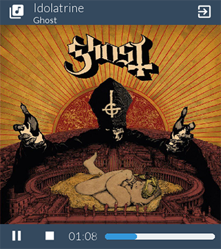

This example will show how to build a somewhat more complex GUI, and link it to several handlers that will control the music playback. The _Music Player_ will also use a function that allow the user to **open a file** from his computer. Furthermore, **icons** will be displayed to compose a more user-friendly GUI.

This is what the _Music Player_ looks like:



It features:

* An _Open music_ button,
* An _Quit_ button,
* A group of label displaying information about the track being played,
* _Play/Pause_ and _Stop_ buttons,
* A progress bar and the associated timer

## Layout and Style files

This GUI uses _asphalt_ as the main background color for its elements.
We will thereby define a button's prototype `styled-button` that will be used multiple times in the layout:

```json
button styled-button
	.text-size 30
	.released-color asphalt
	.pressed-color wet-asphalt
	.hovered-color asphalt
```

The layout file is given below.

A few things to note here:

* setting `show-borders` to `false` removes the border of the window, that is to say its title and the cross used to close it. Therefore, if we will need to add a `Leave` button to close the window, as well as set some of the elements' `drag-window` attribute to `true`. This way, the user will be able to move the window around.
* a label containing a text between `#` will be interpreted as an icon. So `.label #library_music#` will display an icon whose name is _library_music_.
* When no track has been added to the player, a default cover picture is displayed. You can pick [this one](../images/default.png) if you wish.

```json
.title Music
.resolution 400px 450px
.show-borders false

# Main Layout
grid main_grid
	.rows 10% 80% 10%
	.background-color asphalt

	grid header_grid
		.cols 15% 70% 15%

		styled-button open-file_button
			.label #library_music#

		grid info_grid
			.rows 60% 40%

			label title_label
				.label
				.text-size 22
				.drag-window true
				.background-color asphalt
				.text-color clouds

			label artist_label
				.label
				.text-size 16
				.drag-window true
				.background-color asphalt
				.text-color clouds

		styled-button quit_button
			.label #exit_to_app#

	image cover_image
		.source default.png
		.adjust fill

	grid footer_grid
		.cols 15% 15% 15% 55%

		styled-button play-pause_button
			.label #play_arrow#

		styled-button stop_button
			.label #stop#

		label time_label
			.label 00:00
			.text-align center
			.text-color clouds
			.text-size 20
			.background-color asphalt

		progress time_progress
			.completed 0
			.padding 5%
			.full-color peter-river

```

## Python script

What is important here is to demonstrate how to build this GUI and bind it with the Python script. Therefore, the code using the libraries to playback (`pygame.mixer`) and get the track information (`mutagen`) will not be explained in details.

Start the Python file by importing the required libraries and declaring some variables:

```python
from antlia import *
import time as ti
from mutagen.id3 import ID3
from mutagen.mp3 import MP3
from pygame import mixer

# Init music player
mixer.init()

duration = 0
playing = False
song_loaded = False
is_running = True
```

Now, as usual, create the GUI using this command:

```python
GUI = Antlia("examples/musicplayer_layout", "examples/musicplayer_style")
```

### The handlers

When the user clicks on the `Leave` button, the `is_running` variable is changed to `False`. This will cause the main loop to stop, then calling the `quit()` method of the GUI.

```python
def quitClickHandler():
	global is_running
	is_running = False
```

Here is the code to open a song file. What it does basically is open a dialog window using the `GUI.openFileDialog(...)` method, inviting the user to select a file.

After the file path is obtained, several tags are read and the album cover is saved used by the `cover_image` element of the GUI.

```python
def openClickHandler():
	# Change the content of the label with something else
	file_path = GUI.openFileDialog("Open a song", ".mp3", "", None)

	# Check if the file exists, and if its extension is MP3
	if file_path is not None and file_path.lower().endswith('.mp3'):
		global song_loaded
		song_loaded = True

		# Get song tags
		tags = ID3(file_path)

		# Try to get image as jpg
		image_data = tags["APIC:"].data
		if image_data:
			out = open("examples/albumcover.jpg", "wb")
			out.write(image_data)
			out.close()

			# Change the cover image
			GUI.change("cover_image", "source", "examples/albumcover.jpg")
		else:
			# Put the default background
			GUI.change("cover_image", "source", "examples/default.png")

		# Fetch song title and artist
		title = str(tags["TIT2"])
		if title is None:
			title = "Unknown Title"
		GUI.change("title_label", "label", title)

		artist = str(tags["TPE1"])
		if artist is None:
			artist = "Unknown Artist"
		GUI.change("artist_label", "label", artist)

		# Change duration
		global duration
		audio = MP3(file_path)
		duration = audio.info.length

		# Load music for playback
		mixer.music.load(file_path)
		mixer.music.play()
		mixer.music.pause()
```

The `Play/Pause` button will change its icon according to whether or not the song is being played.

```python
def playPauseClickHandler():
	global playing, song_loaded

	if song_loaded:
		if playing:
			mixer.music.pause()

			GUI.change("play-pause_button", "label", "#play_arrow#")
			playing = False
		else:
			mixer.music.unpause()

			GUI.change("play-pause_button", "label", "#pause#")
			playing = True
```

Finally, the `Stop` button stops the music when clicked.

```python
def stopClickHandler():
	global playing, song_loaded

	if song_loaded:
		GUI.change("play-pause_button", "label", "#play_arrow#")
		playing = False
		mixer.music.stop()
		mixer.music.play()
		mixer.music.pause()
```

### Run the GUI

Bind the handlers as follow:

```python
GUI.bind("open-file_button", "click", openClickHandler)
GUI.bind("quit_button", "click", quitClickHandler)

GUI.bind("play-pause_button", "click", playPauseClickHandler)
GUI.bind("stop_button", "click", stopClickHandler)
```

Then start the GUI:

```python
GUI.start()
```

Here is the main loop. It fetches the seconds during wich the song has been played to update the timer and the progress bar.

```python
while not GUI.getUserInfo().want_to_stop and is_running:
	if song_loaded:
		# Update the timer
		sec_passed = mixer.music.get_pos() // 1000
		elapsed = format(sec_passed // 60, '02') + ":" +\
					format(sec_passed % 60, '02')

		GUI.change("time_label", "label", elapsed)
		GUI.change("time_progress", "completed",
					float(sec_passed) / duration * 100.0)

	# Give some rest to the CPU
	ti.sleep(0.1)
```

At the end of the file, quit the GUI:

```python
GUI.quit()
```
