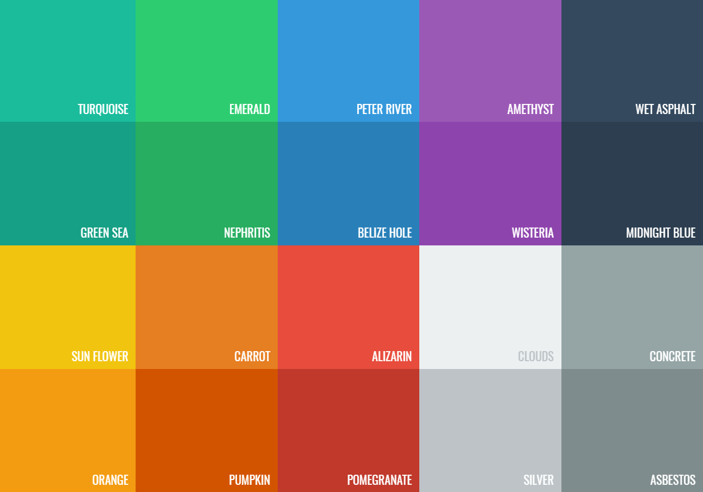

Here is the set of colors natively supported by Antlia is defined [here](https://flatuicolors.com/).

Any color can be used though, provided their hexa or rgb definition.



## Usage

In any `color` attribute, write the name of the color, its hexa or rgb definition:

```json
label my_label
	.text-color green-sea
	.text-size 14
	.font roboto-regular
```
