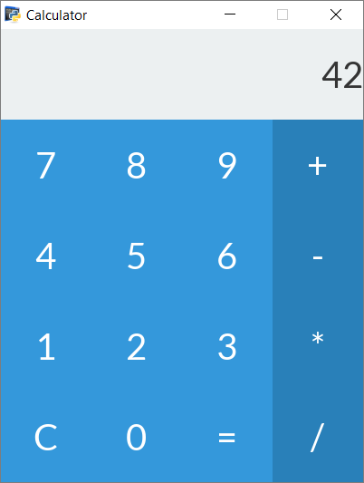

.. _basic-calculator-example:

Basic Calculator
=================

This examples illustrates a more in-depth use of the *Antlia* library to build a very basic calculator.

The GUI will display an area to show the numbers being added or multiplied, as well as a full numeric pad and some operators buttons.

Here is what will look like our basic calculator:

Layout file
-----------------

We start by creating the layout file. Let's call it ``calculator_layout.lia``.

These first two lines specify parameters relevant to the window.::

	.title Calculator
	.resolution 400px 500px

The window will thereby have *Calculator* as a title, and a resolution of 400x500px.

The most basic tool to structure a layout is the grid. Like any other element, we declare a grid by writing the ``grid`` keyword followed by its name, here ``main_grid``.

The following two lines are the grid parameters. Here, we only need two rows, the first will take 20% of the space, the other 80%.::

	grid main_grid
		.rows 20% 80%
		.cols 100%

The two rows need to be filled with elements.

Let's add a label to show the result of the calculator's computations.::

	label result_label
		.label 0
		.text-size 40
		.align right
		.text-color dark-grey
		.background-color clouds

The second row will be filled with another grid. This time, it will have 4 rows and 4 columns. The grid itself will be filled with 16 buttons, whose name and label are specified in order.::

	grid pad_grid
		.rows 25% 25% 25% 25%
		.cols 25% 25% 25% 25%

		button 7
			.label 7
			.text-size 40
		button 8
			.label 8
			.text-size 40
		button 9
			.label 9
			.text-size 40
		button +
			.label +
			.text-size 40
			.released-color belize-hole
			.pressed-color belize-hole
			.hovered-color belize-hole
		button 4
			.label 4
			.text-size 40
		button 5
			.label 5
			.text-size 40
		button 6
			.label 6
			.text-size 40
		button -
			.label -
			.text-size 40
			.released-color belize-hole
			.pressed-color belize-hole
			.hovered-color belize-hole
		button 1
			.label 1
			.text-size 40
		button 2
			.label 2
			.text-size 40
		button 3
			.label 3
			.text-size 40
		button *
			.label *
			.text-size 40
			.released-color belize-hole
			.pressed-color belize-hole
			.hovered-color belize-hole
		button clear
			.label C
			.text-size 40
		button 0
			.label 0
			.text-size 40
		button enter
			.label =
			.text-size 40
		button /
			.label /
			.text-size 40
			.released-color belize-hole
			.pressed-color belize-hole
			.hovered-color belize-hole

The layout is already done!

Python script
-----------------

Now, with a new Python script opened, write down the import statements::

	from antlia import *
	import time as ti

Create the GUI based on the layout file we just created::

	GUI = Antlia("calculator_layout")

For this simple calculator projet, we need to store the expression to evaluate. Here, an ``expression`` list will eventually store two values, and the ``operation`` string will store the type of operation to apply (add, subtract, multiply or divide).::

	expression = [0]
	operation = None

The next thing to do is to define all the handlers to take action when a given button is clicked.

Rather than defining one handler per button, we can define one single ``numpadClickHandler`` for all the numerical buttons by passing a ``digit`` parameter to the handler that will contain the digit the button refers to.

The ``result`` label is changed accordingly.::

	def numpadClickHandler(digit):
		global expression
		expression[-1] = expression[-1] * 10 + digit

		# Change the content of the label with the new value
		GUI.change("result_label", "label", str(expression[-1]))

The ``operatorClickHandler`` is even simpler.::

	def operatorClickHandler(operator):
		global operation, expression
		operation = operator
		expression.append(0)

The clear button will reset everything.::

	def clearClickHandler():
		global operation, expression

		expression = [0]
		operation = None

		# Change the content of the label with the new value
		GUI.change("result_label", "label", str(expression[-1]))

The last button to take care of is the *enter* button. Since this example is very simple, nothing is done to check if the inputs are correct before evaluating the expression.::

	def enterClickHandler():
		global operation, expression
		# Simple example, won't handle errors...
		if operation == "+":
			result = expression[0] + expression[1]
		elif operation == "-":
			result = expression[0] - expression[1]
		elif operation == "*":
			result = expression[0] * expression[1]
		elif operation == "/":
			result = expression[0] / expression[1]

		expression = [result]
		operation = None

		# Change the content of the label with the result
		GUI.change("result_label", "label", str(result))

Then comes the bindings. This is just a succession of simple statements. The ``arg`` value is specified to use a single *handler* finction for different buttons.::

	GUI.bind("0", "click", numpadClickHandler, arg=0)
	GUI.bind("1", "click", numpadClickHandler, arg=1)
	GUI.bind("2", "click", numpadClickHandler, arg=2)
	GUI.bind("3", "click", numpadClickHandler, arg=3)
	GUI.bind("4", "click", numpadClickHandler, arg=4)
	GUI.bind("5", "click", numpadClickHandler, arg=5)
	GUI.bind("6", "click", numpadClickHandler, arg=6)
	GUI.bind("7", "click", numpadClickHandler, arg=7)
	GUI.bind("8", "click", numpadClickHandler, arg=8)
	GUI.bind("9", "click", numpadClickHandler, arg=9)

	GUI.bind("+", "click", operatorClickHandler, arg="+")
	GUI.bind("-", "click", operatorClickHandler, arg="-")
	GUI.bind("*", "click", operatorClickHandler, arg="*")
	GUI.bind("/", "click", operatorClickHandler, arg="/")

	GUI.bind("clear", "click", clearClickHandler)
	GUI.bind("enter", "click", enterClickHandler)

Add the remaining lines to make everything work::

	# Open the GUI window
	GUI.start()

	# Main loop, wait for exit event
	while not GUI.getUserInfo().want_to_stop:
		# Give some rest to the CPU
		ti.sleep(0.1)

	# Destroy the GUI properly
	GUI.quit()

Full code
-----------------

Here is the full Python script::

	from antlia import *
	import time as ti

	# Create a GUI based on a layout file and a style file
	GUI = Antlia("examples/calculator_layout")

	# Store the expression to be calculated
	expression = [0]
	operation = None

	# Define handlers for the buttons
	def numpadClickHandler(digit):
		global expression
		expression[-1] = expression[-1] * 10 + digit

		# Change the content of the label with the new value
		GUI.change("result_label", "label", str(expression[-1]))

	def operatorClickHandler(operator):
		global operation, expression
		operation = operator
		expression.append(0)

	def clearClickHandler():
		global operation, expression

		expression = [0]
		operation = None

		# Change the content of the label with the new value
		GUI.change("result_label", "label", str(expression[-1]))

	def enterClickHandler():
		global operation, expression
		# Simple example, won't handle errors...
		if operation == "+":
			result = expression[0] + expression[1]
		elif operation == "-":
			result = expression[0] - expression[1]
		elif operation == "*":
			result = expression[0] * expression[1]
		elif operation == "/":
			result = expression[0] / expression[1]

		expression = [result]
		operation = None

		# Change the content of the label with the result
		GUI.change("result_label", "label", str(result))

	# Bind the handlers to the buttons
	GUI.bind("0", "click", numpadClickHandler, arg=0)
	GUI.bind("1", "click", numpadClickHandler, arg=1)
	GUI.bind("2", "click", numpadClickHandler, arg=2)
	GUI.bind("3", "click", numpadClickHandler, arg=3)
	GUI.bind("4", "click", numpadClickHandler, arg=4)
	GUI.bind("5", "click", numpadClickHandler, arg=5)
	GUI.bind("6", "click", numpadClickHandler, arg=6)
	GUI.bind("7", "click", numpadClickHandler, arg=7)
	GUI.bind("8", "click", numpadClickHandler, arg=8)
	GUI.bind("9", "click", numpadClickHandler, arg=9)

	GUI.bind("+", "click", operatorClickHandler, arg="+")
	GUI.bind("-", "click", operatorClickHandler, arg="-")
	GUI.bind("*", "click", operatorClickHandler, arg="*")
	GUI.bind("/", "click", operatorClickHandler, arg="/")

	GUI.bind("clear", "click", clearClickHandler)
	GUI.bind("enter", "click", enterClickHandler)

	# Open the GUI window
	GUI.start()

	# Main loop, wait for exit event
	while not GUI.getUserInfo().want_to_stop:
		# Give some rest to the CPU
		ti.sleep(0.1)

	# Destroy the GUI properly
	GUI.quit()

And the layout file::

	.title Calculator
	.resolution 400px 500px

	grid main_grid
		.rows 20% 80%
		.cols 100%

		label result_label
			.label 0
			.text-size 40
			.align right
			.text-color dark-grey
			.background-color clouds

		grid pad_grid
			.rows 25% 25% 25% 25%
			.cols 25% 25% 25% 25%

			button 7
				.label 7
				.text-size 40
			button 8
				.label 8
				.text-size 40
			button 9
				.label 9
				.text-size 40
			button +
				.label +
				.text-size 40
				.released-color belize-hole
				.pressed-color belize-hole
				.hovered-color belize-hole
			button 4
				.label 4
				.text-size 40
			button 5
				.label 5
				.text-size 40
			button 6
				.label 6
				.text-size 40
			button -
				.label -
				.text-size 40
				.released-color belize-hole
				.pressed-color belize-hole
				.hovered-color belize-hole
			button 1
				.label 1
				.text-size 40
			button 2
				.label 2
				.text-size 40
			button 3
				.label 3
				.text-size 40
			button *
				.label *
				.text-size 40
				.released-color belize-hole
				.pressed-color belize-hole
				.hovered-color belize-hole
			button clear
				.label C
				.text-size 40
			button 0
				.label 0
				.text-size 40
			button enter
				.label =
				.text-size 40
			button /
				.label /
				.text-size 40
				.released-color belize-hole
				.pressed-color belize-hole
				.hovered-color belize-hole
