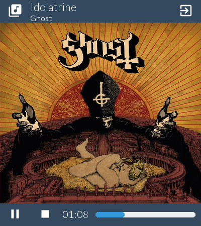

.. _music-player-example:

Music Player
=================

This example will show how to build a somewhat more complex GUI, and link it to several handlers that will control the music playback. The *Music Player* will also use a function that allow the user to **open a file** from his computer. Furthermore, **icons** will be displayed to compose a more user-friendly GUI.

This is what the *Music Player* looks like the following image.

It features:

* An *Open file* button,
* An *Quit* button,
* A group of label displaying information about the track being played,
* *Play/Pause* and *Stop* buttons,
* A progress bar

Layout and Style files
-----------------

The color chart of this *Music Player* is mainly made of the ``asphalt`` color.

The default button style will be specified in the ``musicplayer_style.lia`` file::

	button styled-button
		.text-size 30
		.released-color asphalt
		.pressed-color wet-asphalt
		.hovered-color asphalt

This button will now be available to use in the *layout* file ``musicplayer_layout.lia``.

The Python source::

	from antlia import *
	import time as ti
	from mutagen.id3 import ID3
	from mutagen.mp3 import MP3
	from pygame import mixer

	# Init music player
	mixer.init()

	duration = 0
	playing = False
	song_loaded = False
	is_running = True

	# Create a GUI based on a layout file and a style file
	GUI = Antlia("musicplayer_layout", "musicplayer_style")

	# Define a handler for the button
	def quitClickHandler():
		global is_running
		is_running = False

	def openClickHandler():
		# Change the content of the label with something else
		file_path = GUI.openFileDialog("Open a song", ".mp3", "", None)

		# Check if the file exists, and if its extension is MP3
		if file_path is not None and file_path.lower().endswith('.mp3'):
			global song_loaded
			song_loaded = True

			# Get song tags
			tags = ID3(file_path)

			# Try to get image as jpg
			image_data = tags["APIC:"].data
			if image_data:
				out = open("albumcover.jpg", "wb")
				out.write(image_data)
				out.close()

				# Change the cover image
				GUI.change("cover_image", "source", "albumcover.jpg")
			else:
				# Put the default background
				GUI.change("cover_image", "source", "default.png")

			# Fetch song title and artist
			title = str(tags["TIT2"])
			if title is None:
				title = "Unknown Title"
			GUI.change("title_label", "label", title)

			artist = str(tags["TPE1"])
			if artist is None:
				artist = "Unknown Artist"
			GUI.change("artist_label", "label", artist)

			# Change duration
			global duration
			audio = MP3(file_path)
			duration = audio.info.length

			# Load music for playback
			mixer.music.load(file_path)
			mixer.music.play()
			mixer.music.pause()

	def playPauseClickHandler():
		global playing, song_loaded

		if song_loaded:
			if playing:
				mixer.music.pause()

				GUI.change("play-pause_button", "label", "#play_arrow#")
				playing = False
			else:
				mixer.music.unpause()

				GUI.change("play-pause_button", "label", "#pause#")
				playing = True

	def stopClickHandler():
		global playing, song_loaded

		if song_loaded:
			GUI.change("play-pause_button", "label", "#play_arrow#")
			playing = False
			mixer.music.stop()
			mixer.music.play()
			mixer.music.pause()

	# Bind the handlers to the buttons
	GUI.bind("open-file_button", "click", openClickHandler)
	GUI.bind("quit_button", "click", quitClickHandler)

	GUI.bind("play-pause_button", "click", playPauseClickHandler)
	GUI.bind("stop_button", "click", stopClickHandler)

	# Open the GUI
	GUI.start()

	# Main loop, wait for stop event
	while not GUI.getUserInfo().want_to_stop and is_running:
		if song_loaded:
			# Update the timer
			sec_passed = mixer.music.get_pos() // 1000
			elapsed = format(sec_passed // 60, '02') + ":" +\
						format(sec_passed % 60, '02')

			GUI.change("time_label", "label", elapsed)
			GUI.change("time_progress", "completed",
						int(sec_passed / duration * 100))

		# Give some rest to the CPU
		ti.sleep(0.1)

	# Destroy the GUI properly
	GUI.quit()

The *Music Player* style file::

	button styled-button
		.text-size 30
		.released-color asphalt
		.pressed-color wet-asphalt
		.hovered-color asphalt

The *Music Player* layout file::

	.title Music
	.resolution 400px 450px
	.show-borders false

	# Main Layout
	grid main_grid
		.rows 10% 80% 10%
		.cols 100%
		.background-color asphalt

		grid header_grid
			.rows 100%
			.cols 15% 70% 15%

			styled-button open-file_button
				.label #library_music#

			grid info_grid
				.rows 60% 40%
				.cols 100%

				label title_label
					.label
					.text-size 22
					.background-color asphalt

				label artist_label
					.label
					.text-size 16
					.background-color asphalt

			styled-button quit_button
				.label #exit_to_app#

		image cover_image
			.source examples/default.png
			.adjust fill

		grid footer_grid
			.rows 100%
			.cols 15% 15% 15% 55%

			styled-button play-pause_button
				.label #play_arrow#

			styled-button stop_button
				.label #stop#

			label time_label
				.label 00:00
				.align center
				.text-size 20
				.background-color asphalt

			progress time_progress
				.completed 0
				.full-color peter-river
